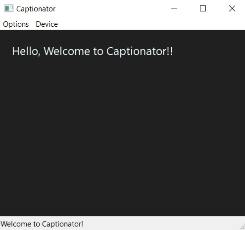

# Captionator

Live speech to text using vosk.



## Build Instructions
Requires python 3.6 - 3.9

NOTE: Recommended to use a virtual environment.

Install the following libraries:

* Vosk
* wxPython
* Sounddevice
* Pyautogui

Download a model from - https://alphacephei.com/vosk/models

Extract the model, rename it and place it in the same folder as ```Captionator.py```.

Run the ```Captionator.py``` script.
